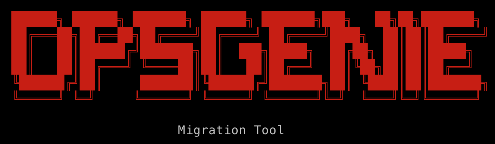
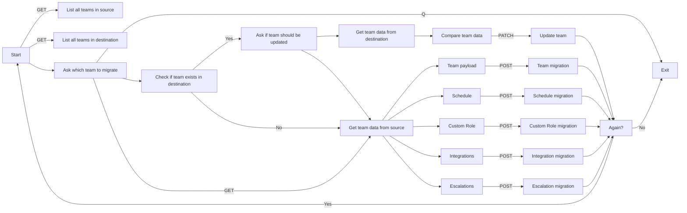

# Opsgenie Migration Tool

<p align="center">
    
</p>

`Opsgenie Migration Tool` helps you to migrate your data from one Opsgenie account to another. It is a CLI tool that uses the Opsgenie REST API to export data from the source account and import it into the target account.

---

## Table of Contents

- [Opsgenie Migration Tool](#opsgenie-migration-tool)
  - [Table of Contents](#table-of-contents)
  - [About Opsgenie](#about-opsgenie)
  - [Prerequisites](#prerequisites)
  - [Installation](#installation)
  - [Python Virtual Environment](#python-virtual-environment)
  - [Python Requirements](#python-requirements)
  - [Python Usage](#python-usage)
  - [Known Limitations](#known-limitations)
  - [Flowchart | Opsgenie API Migration](#flowchart--opsgenie-api-migration)

---

## About Opsgenie

Opsgenie is a modern incident management platform for operating always-on services, empowering Dev & Ops teams to plan for service disruptions and stay in control during incidents. With over 200 deep integrations and a highly flexible rules engine, Opsgenie centralizes alerts, notifies the right people reliably, and enables them to take rapid action. Throughout the incident lifecycle, Opsgenie tracks all activity and provides actionable insights to improve productivity and drive continuous operational efficiencies.

Opsgenie is a Atlassian product. Atlassian is a leading provider of team collaboration and productivity software and the maker of Jira, Confluence, Bitbucket, and Trello products.

---

You can use this tool to migrate the following data:

- [x] Teams
- [x] Users
- [x] Schedules
- [x] Custom Roles
- [x] Escalations
- [x] Policies
- [x] Integrations
- [x] Rotation Schedules

---

## Prerequisites

- Python 3.12 or later
- An API key for the source Opsgenie account
- An API key for the target Opsgenie account

---

## Installation

1. Clone the repository
2. Create a `.env` file in the root directory
3. Add the following variables to the `.env` file

    ```bash
    # Source Opsgenie API Key
    SOURCE_API_KEY=""
    # Destination Opsgenie API Key
    DESTINATION_API_KEY=""
    # Source Opsgenie API URL
    BASE_URL="https://api.eu.opsgenie.com"
    ```

---

## Python Virtual Environment

```bash
python -m venv .venv
source .venv/bin/activate
pip install -r requirements.txt
```

## Python Requirements

- requests
- python-dotenv
- termcolor

[🔝](#table-of-contents)

---

## Python Usage

```bash
python main.py --color
```

[🔝](#table-of-contents)

---

## Known Limitations

- Slack integration can't be migrated using API

[🔝](#table-of-contents)

---

## Flowchart | Opsgenie API Migration



[🔝](#table-of-contents)

---
